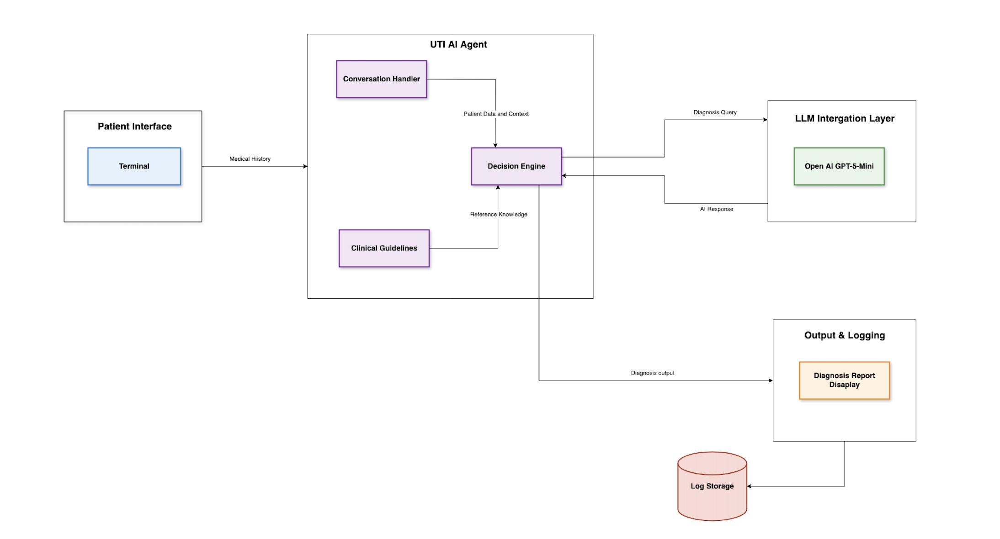

# ⚕️ UTI (Urinary Tract Infection) Clinical AI Agent
An intelligent AI-powered healthcare agent built with **Node.js**, **OpenAI GPT-5 API**, and **Winston logging** that specializes in diagnosing and treating urinary tract infections (UTIs) following clinical guidelines. 

### 🎯 **Overview**

This AI Agent can:
- Collect patient symptoms and medical history
- Assess eligibility for UTI treatment
- Prescribe appropriate antibiotic treatments
- Provide patient education and follow-up instructions

---

### 📎 **Architecture Diagram**



---

### 🚀 ***Features***

1. **Clinical Assessment & Treatment Recommendations**
- Systematic step-by-step collection of patient symptoms and medical history
- Evidence-based eligibility evaluation and risk factor assessment
- Red flag detection and referral recommendations
- First-line and alternative antibiotic selection
- Automatic signaling when all patient information is collected
- Structured JSON outputs for diagnostic and treatment reports

2. **AI-Powered Intelligence & Reporting**
- OpenAI GPT-5 LLM powers conversational interactions
- Generates structured JSON diagnostic reports
- Eligibility assessment with confidence score
- Detailed reasoning for clinical decisions
- Restricted to UTI-related topics with automatic redirection for off-topic questions

3. **Logging**
- Role-based logging (User/Agent/System)
- Local file storage

---

### 🏥 **Clinical Guidelines**

The agent follows evidence-based UTI treatment guidelines from the [Ontario College of Pharmacists Assessment & Prescribing Algorithm for Uncomplicated Urinary Tract Infection (Cystitis)](https://www.ocpinfo.com/wp-content/uploads/2022/12/assessment-prescribing-algorithm-urinary-tract-infection-english.pdf).

---

### ⚖️ **Eligibility Criteria**
- Adult (≥18 years)
- Female patients only
- Non-pregnant
- No fever/chills or flank pain
- No recurrent UTIs
- No complicating factors

---

### 📁 **Project Structure**

```
uti-clinical-ai-agent/
├── src/
│   ├── index.js              # Main application entry point
│   ├── utiAgent.js           # Core UTI agent logic
│   ├── guidelines.js         # Clinical guidelines and algorithms
│   ├── openaiService.js      # OpenAI API integration
│   ├── terminal.js           # Terminal UI and display functions
│   └── utils/
│       └── logger.js         # Winston-based logging system
├── logs/                     # Application logs (not in git)
├── package.json              # Dependencies and scripts
├── .env                      # Environment variables (not in git)
└── README.md                 # This file
```
---

### 📊 **Logging**

The system generates comprehensive logs for:
- User interactions
- Agent responses
- Clinical decisions
- System events
- Error tracking

```json
{
  "timestamp": "2024-01-15 19:30:45",
  "level": "info",
  "message": "User Input",
  "role": "user",
  "content": "I have burning sensation"
}
```

---

### 🔖 **Test Scenarios**
- **Eligible Patient**: Female, 25, non-pregnant, uncomplicated symptoms
- **Ineligible Patient**: Male, pregnant, or with red flags
- **Edge Cases**: Allergies, kidney disease, recurrent UTIs

---

### 📋 **Prerequisites**

- Node.js
- npm or yarn
- OpenAI API key

---

### 🛠️ **Installation**

1. **Clone the repository**
   ```bash
   git clone git@github.com:karthikdurai-kd/uti-clinical-ai-agent.git
   cd uti-clinical-ai-agent
   ```

2. **Install dependencies**
   ```bash
   npm install
   ```

3. **Set up environment variables**
   ```bash
   cp .env.example .env
   # Add your OpenAI API key
   OPENAI_API_KEY=your_api_key_here
   ```

4. **Start the Agent**
   ```bash
   npm start
   ```